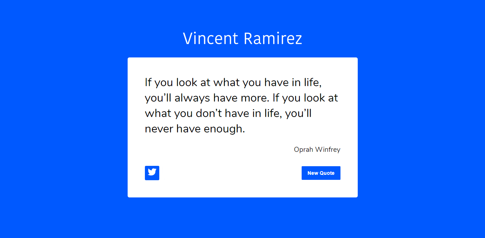

# Random Quote Generator in React

Challenge: Create a quote generator app with a random order and use React to handle the interface. Don't look at the existing solution. Complete the user stories below:




<h1 align="center">Quote Random Academlo</h1>

<div align="center">
  <h3>
    <a href="https://{quote-random-academlo.netlify.app}">
      Demo
    </a>
    <span> | </span>
    <a href="https://{github.com/vincentramirezweb}">
      Solution
    </a>
  </h3>
</div>

<!-- TABLE OF CONTENTS -->

## Table of Contents

-   [Built With](#built-with)
-   [How to use](#how-to-use)
-   [Contact](#contact)
-   [Acknowledgements](#acknowledgements)

<!-- Built With -->

### Built With

-   [React](https://reactjs.org/)

## How To Use

<!-- Example: -->

To clone and run this application, you'll need [Git](https://git-scm.com) and [Node.js](https://nodejs.org/en/download/) (which comes with [npm](http://npmjs.com)) installed on your computer. From your command line:

```bash
# Clone this repository
$ git clone https://github.com/your-user-name/your-project-name

# Install dependencies
$ npm install

# Run the app
$ npm start
```

## Acknowledgements

All the advice and tips I received in the Academlo class from Professor [Sh3yk0](https://github.com/SheykoWk)

## Contact

-   Website [https://vincentramirez.com](https://{vincent-ramirez-portafolio.netlify.app})
-   GitHub [@vincentramirezweb](https://{github.com/vincentramirezweb})
